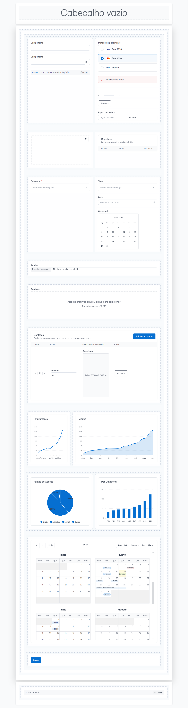
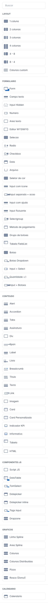
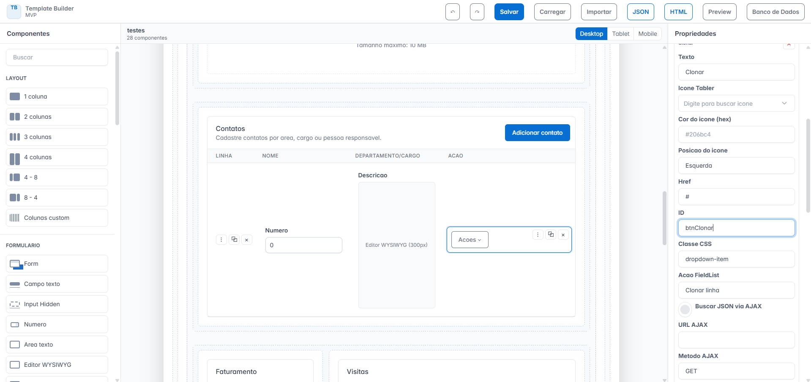
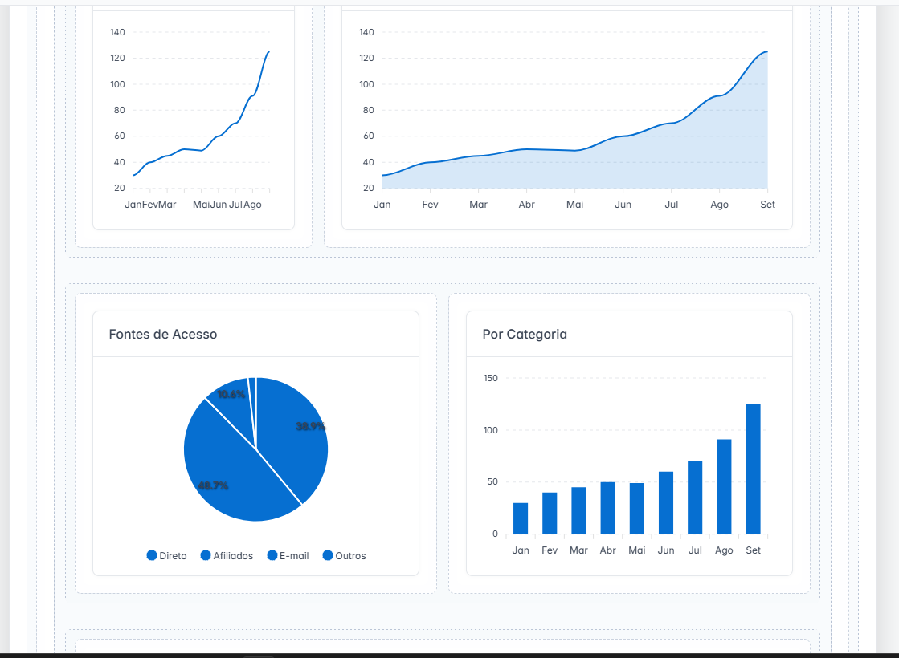
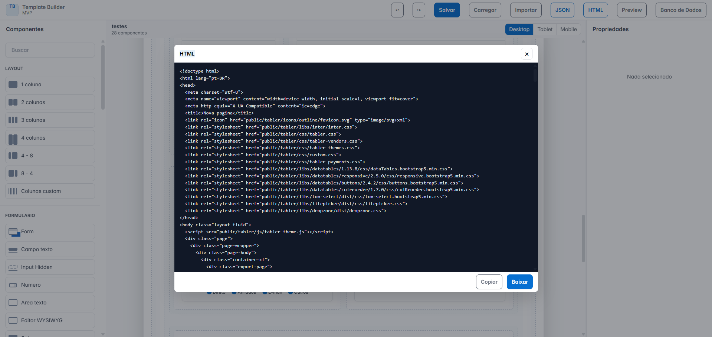
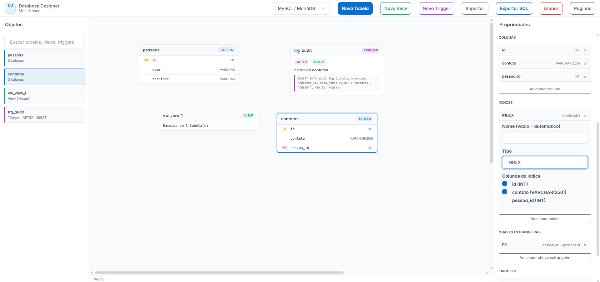
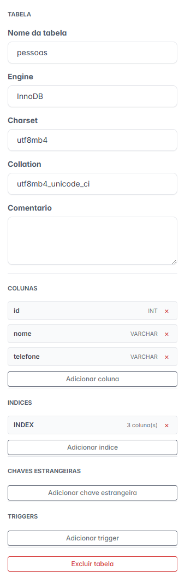
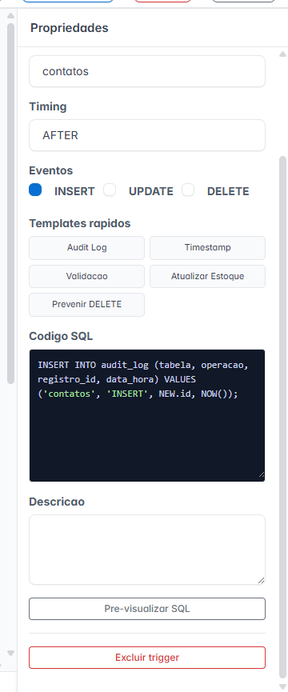

# Dev Studio Builder

> Plataforma visual para criação de páginas HTML, formulários e modelagem de banco de dados utilizando Drag & Drop.

O Dev Studio Builder é uma ferramenta voltada para desenvolvedores que desejam acelerar a construção de sistemas administrativos, ERPs, CRMs, dashboards e aplicações corporativas, mantendo consistência visual e reduzindo a quantidade de código manual.

Através de uma interface visual intuitiva, é possível montar páginas utilizando componentes pré-configurados, personalizar propriedades em tempo real, exportar HTML pronto para produção e modelar bancos de dados visualmente.

---

# Motivação

Durante o desenvolvimento de sistemas web, uma das tarefas mais repetitivas é a criação de telas administrativas.

Mesmo utilizando Inteligência Artificial para geração de código, frequentemente surgem problemas como:

* Falta de padronização entre telas;
* Necessidade de ajustes manuais constantes;
* Código repetitivo;
* Perda de produtividade;
* Dificuldade em manter a identidade visual do sistema.

O Dev Studio Builder nasceu para resolver esses problemas através de uma abordagem visual, reutilizável e padronizada.

---

# O Que o Dev Studio Builder Resolve?

✅ Criação rápida de interfaces administrativas

✅ Padronização visual entre telas

✅ Redução de código repetitivo

✅ Reutilização de componentes

✅ Exportação de HTML pronto para uso

✅ Modelagem visual de banco de dados

✅ Geração de SQL para múltiplos bancos

✅ Persistência de projetos em JSON

✅ Facilidade de manutenção

✅ Maior produtividade para equipes de desenvolvimento

---

# Principais Recursos

## Page Builder

Editor visual baseado no ecossistema do Template Tabler.

### Funcionalidades

* Drag & Drop
* Edição visual em tempo real
* Layout responsivo
* Painel de propriedades
* Componentes reutilizáveis
* HTML personalizado
* Exportação para HTML
* Exportação para JSON
* Importação de projetos JSON

### Componentes Disponíveis

Mais de 60 componentes prontos para uso:

**Layout**
* Form Container (com aviso de alterações não salvas ao sair)
* Card / Card Personalizado
* Divisor de Seção
* Page Header

**Conteúdo**
* Título (H1–H3, com pretitle e alinhamento)
* Parágrafo (alinhamento, muted)
* Imagem (forma, lazy, link)
* Lista (ordenada/não-ordenada, list-group, flush)
* Badge (variante, pill, outline)
* Alert
* Progress Bar
* Spinner
* Avatar
* Stat Card (KPI visual)
* Empty State
* Callout
* Timeline
* Stepper
* Skeleton (placeholder animado)
* KPI / Info KPI (ícone, tendência)
* Tabela (striped, hover, bordered, responsive, thead/tfoot configuráveis)

**Formulário**
* Campo Texto (prefix/suffix addon, máscara, toggle senha)
* Número
* Textarea
* Select
* Checkbox / Radio / Switch
* Floating Label Input
* Rating (estrelas interativas)
* Separated Input
* Input com Ícone
* Quantity Stepper
* Payment Method
* Código 2FA / OTP (quantidade de dígitos configurável, auto-avanço e colar)

**Interação**
* Botão (variante, outline, tamanho, disabled, link)
* Grupo de Botões
* Button Dropdown
* Input + Botão (AJAX Fill)
* Input + Select
* Modal (com trigger)
* Offcanvas (com trigger e ID gerado)
* Tabs (com badge por aba)
* Accordion
* Breadcrumb
* FAB — Botão flutuante de ajuda/suporte (link único ou *speed-dial* com subitens; ícone, cor, raio e posição configuráveis)

**Navegação**
* Navbar / Sidebar (sistema de menus visuais)
* Menu Item, Dropdown, Divider, Label, Badge Item, User, Search, Spacer, Tela Cheia, **Alternar Tema (claro/escuro)**

**Avançados**
* DataTable (client-side, AJAX, server-side, seleção por checkbox)
* Tom Select / Tags Input (busca remota server-side, botão "criar" via modal/iframe ou nova aba)
* Litepicker
* ApexCharts (linha, barra, pizza, donut, área...)
* FullCalendar
* Gantt / Timeline (reservas, agendamentos — modos Timeline e Agenda, mobile-first, dados via AJAX)
* Dropzone Upload
* Rich Text Editor (HugeRTE)
* Signature Pad
* Máscaras de Entrada
* Toggle de Senha
* Listas Dinâmicas (FieldList: clonar, excluir e mover linha ↑/↓)
* Script JS (jQuery com templates)
* HTML Raw

**Mídia / Documentos**
* PWA (app instalável — manifest, service worker, offline e notificações)
* Documento Office (Word/Excel/PPT via visualizador online — Microsoft/Google)
* PDF (PDF.js inline, mobile-first, renderiza no `<canvas>`)

### Tipos de Menu (Layouts de Navegação)

O menu é montado visualmente (componentes **Navbar** e **Sidebar**) e exportado conforme o **layout** escolhido nas propriedades da página. Todos respeitam o **tema claro/escuro** e as **colunas** definidas no menu (alinhamento esquerda / centro / direita). Indisponível em páginas de login.

| Layout | Descrição |
|---|---|
| **Nenhum** | Sem menu (página limpa). |
| **Superior (navbar)** | Menu horizontal no topo. |
| **Lateral (sidebar)** | Menu vertical à esquerda ou à direita (posição configurável). |
| **Lateral + Superior** | Sidebar + navbar combinados. |
| **Pill + Ícone lateral (moderno)** | Rail de ícones à esquerda (expande ao passar o mouse) + navbar estilo *pill* no topo. |
| **Rail de módulos + topo (Metronic)** | Rail de ícones *full-height* à esquerda (os módulos) + barra superior embutida no conteúdo (os itens do módulo ativo). No desktop o conteúdo fica em um painel arredondado "dentro" do menu; no mobile ocupa 100% da tela e o rail vira off-canvas (hambúrguer). Os dropdowns flutuam acima do conteúdo. |

Recursos comuns aos layouts: tema **claro/escuro**, **posição do sidebar** (esquerda/direita), menu **fixo** (sticky), **rolagem horizontal** dos itens quando não cabem e o componente **Tela Cheia**.

### Temas & Aparência

* **Tema base trocável:** a paleta de cinza vem de um arquivo `theme-<nome>.css` importado no `theme.css` — *gray, slate, zinc, neutral, stone, pink*.
* **Temas de conforto visual** (menos fadiga ocular): **Sépia** (papel/creme, foco em descanso), **Sálvia** (verde suave) e **Solarized** (versão suavizada).
* **Cor primária, radius e fonte** ajustáveis em um único arquivo (`theme-config.css`).
* **Superfícies tingíveis** (`--tblr-surface-base`): cards/sidebars acompanham o tema, não só o fundo.
* **Modo claro/escuro** com persistência no navegador (componente de menu **Alternar Tema**).

Como tudo se conecta: [`docs/TEMAS_E_CSS.md`](docs/TEMAS_E_CSS.md).

---

## Database Designer

Editor visual para modelagem de bancos de dados.

### Funcionalidades

* Criação de tabelas
* Criação de campos
* Chaves primárias
* Chaves estrangeiras
* Índices
* Views
* Triggers
* Relacionamentos visuais
* Painel de propriedades em tempo real
* Exportação para SQL

### Bancos Suportados

* MySQL
* PostgreSQL
* SQLite
* SQL Server
* Firebird
* Oracle

---

## Report Builder

Gerador visual de **templates de relatório** para impressão em PDF via **DOMPDF** (Laravel).
Monta o layout (cabeçalho, rodapé, seções, tabelas, QR Code, código de barras) e exporta
HTML com placeholders; os dados e a geração do PDF ficam a cargo do backend.

### Funcionalidades

* Configuração de página (A4/Letter/A3, orientação, margens, fontes, cores)
* Cabeçalho e rodapé que se repetem em todas as páginas (numeração automática)
* Seções: Informações, Tabela de Dados (com `@foreach`), Resumo/Totais, Divisor, HTML Livre
* QR Code e Código de Barras (imagem gerada no servidor)
* **Tabela de Layout**: grade com células e blocos aninhados (base para DANFE de NF-e)
* Propriedades de aparência (cor, fundo, fonte, alinhamento)
* Exportação de HTML pronto para DOMPDF + persistência em `localStorage`

Documentação completa: [`docs/REPORT_BUILDER.md`](docs/REPORT_BUILDER.md).

---

# Capturas de Tela

## Editor de Páginas

```text
docs/screenshots/tela-principal.png
```



---

## Componentes

```text
docs/screenshots/componentes.png
```



---

## Painel de Propriedades

```text
docs/screenshots/fieldlist.png
```



---

## Gráficos

```text
docs/screenshots/graficos.png
```



---

## Exportação HTML

```text
docs/screenshots/exportar-codigo-html.png
```



---

## Database Designer

```text
docs/screenshots/tabelas.png
```



---

## Database Designer Propriedades da Tabela

```text
docs/screenshots/propriedades-tabela.png
```



---

## Database Designer Triggers

```text
docs/screenshots/trigger.png
```



---
# Como Instalar

## Requisitos

* Navegador moderno
* Servidor Web local
* Git

---

## Clonar o Repositório

```bash
git clone https://github.com/marcoscarraro/dev-studio-builder.git
```

Acesse a pasta do projeto:

```bash
cd dev-studio-builder
```

---

## Executar Localmente

### Utilizando PHP

```bash
php -S localhost:8000
```

### Utilizando Python

```bash
python -m http.server 8000
```

Abra no navegador:

```text
http://localhost:8000
```

---

# Como Utilizar

## Criando uma Página

1. Abra o editor.
2. Arraste componentes da barra lateral.
3. Solte os componentes na área de trabalho.
4. Configure suas propriedades.
5. Visualize as alterações em tempo real.
6. Exporte o HTML ou salve o projeto em JSON.

---

## Exportando HTML

1. Clique em **Exportar HTML**.
2. O sistema gerará o código completo.
3. Utilize o HTML exportado em qualquer projeto compatível com Tabler.

---

## Exportando JSON

1. Clique em **Exportar JSON**.
2. Salve o arquivo gerado.
3. Utilize-o posteriormente para continuar a edição.

---

## Importando Projetos

1. Clique em **Importar Projeto**.
2. Selecione um arquivo JSON exportado anteriormente.
3. O projeto será reconstruído automaticamente no editor.

---

# Arquitetura do Projeto

O Dev Studio Builder foi desenvolvido utilizando uma arquitetura modular para facilitar manutenção e extensibilidade.

## Estrutura de Pastas

```text
assets/
│
├── css/
│
├── data/
│   └── components.json
│
├── js/
│   ├── builder.js
│   │
│   ├── core/
│   │   ├── helpers.js
│   │   ├── drag-drop.js
│   │   ├── properties.js
│   │   └── export-html.js
│   │
│   └── renderers/
│       ├── registry.js
│       ├── input.js
│       ├── select.js
│       ├── card.js
│       └── ...
│
public/
│
└── components/
    └── js/
        ├── datatable-runtime.js
        ├── apexchart-runtime.js
        ├── dropzone-runtime.js
        └── ...
│
database_builder.html

assets/js/database-builder.js

assets/css/database-builder.css
```

---

# Arquitetura dos Componentes

## Catálogo de Componentes

Todos os componentes disponíveis são definidos em:

```text
assets/data/components.json
```

Cada componente possui:

* Identificador
* Tipo
* Propriedades
* Valores padrão
* Renderer
* Dependências
* Comportamentos

---

## Renderers

Cada componente possui um renderer independente responsável pela geração do HTML.

Exemplo:

```text
assets/js/renderers/input.js
```

O renderer transforma as propriedades configuradas pelo usuário em HTML final.

---

## Runtimes

Componentes que necessitam comportamento JavaScript possuem runtimes independentes.

Exemplos:

* DataTables
* ApexCharts
* FullCalendar
* Dropzone
* Litepicker
* Tom Select
* Máscaras
* Signature Pad

Os runtimes são adicionados automaticamente durante a exportação do HTML.

---

# Criando Novos Componentes

O Dev Studio Builder foi projetado para ser extensível.

Novos componentes podem ser criados através de:

1. Cadastro no `components.json`
2. Criação de um renderer
3. Criação de um runtime (quando necessário)

A documentação completa está disponível na pasta:

```text
docs/
```

---

# Documentação

Documentação para desenvolvedores:

* [Guia do Desenvolvedor (arquitetura)](docs/GUIA_DESENVOLVEDOR.md)
* [Temas & Funcionamento do CSS](docs/TEMAS_E_CSS.md)
* Como Criar Componentes
* Exemplos de Componentes
* Contrato do components.json
* Mapa da Arquitetura
* Checklist de Testes
* Como Criar Novas Funcionalidades
* [Report Builder (templates de relatório para DOMPDF)](docs/REPORT_BUILDER.md)
* [Integração com Laravel](docs/INTEGRACAO_LARAVEL.md)
* [PWA (app instalável)](docs/PWA.md)
* [Documento Office (Word/Excel/PPT)](docs/COMPONENTE_OFFICE_VIEWER.md)
* [PDF (PDF.js)](docs/COMPONENTE_PDF.md)
* [Tom Select — botão criar (modal/iframe)](docs/COMPONENTE_TOMSELECT_CREATE_LARAVEL.md)

---

# Licença

Este projeto é distribuído sob a licença MIT.

Você pode:

* Utilizar comercialmente;
* Modificar;
* Distribuir;
* Utilizar em projetos privados;
* Criar soluções derivadas.

Desde que os avisos de copyright e licença sejam preservados.

---

# Apoie o Projeto

Se o Dev Studio Builder ajudou você a economizar tempo no desenvolvimento de sistemas, considere apoiar o projeto.

Sua contribuição ajuda na manutenção, documentação e implementação de novas funcionalidades.

## Chave PIX

```text
50481825000143
```

Obrigado por apoiar o software livre e o desenvolvimento open source.


